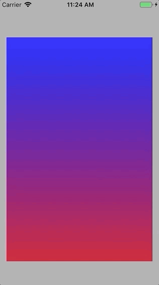

# YSScrollDetecter
YSScrollDetecterは簡単に使えるiOS用のswift製スクロール検出ライブラリです。


　
　

# Features
UIScrollViewを上下に引っ張った時に画面を閉じる等、なにかしらの処理を挿し込むことができるライブラリです。

# Installation
### CocoaPods

Podfileに 
```
pod 'YSScrollDetecter', :git => 'https://github.com/sekies/YSScrollDetecter.git'
```
と追加します。
pod install します。


# Usage

まず、InterfaceBuilder等でUIScrollViewを配置します。
UIScrollViewを配置したViewControllerをUIScrollViewDelegateに準拠させます。
```Swift
class ViewController: UIViewController,UIScrollViewDelegate
```
YSRadioButtonをインポートします。
 ```Swift
 import YSScrollDetecter
 ```

YSScrollDetecterを生成します。引数として上下に引っ張ったときに処理を発動するまでの閾値を渡します。
 ```Swift
  scrollDetecter = YSScrollDetecter(topOffsetMax: 40, bottomOffsetMax: 40)
 ```

UIScrollViewDelegateの以下二つのメソッドでYSScrollDetecterにscrollViewを渡します。
```Swift
  func scrollViewDidScroll(_ scrollView: UIScrollView) {
      scrollDetecter.scrollViewDidScroll(scrollview)
  }
  
  
  func scrollViewWillEndDragging(_ scrollView: UIScrollView, withVelocity velocity: CGPoint, targetContentOffset: UnsafeMutablePointer<CGPoint>) {
      scrollDetecter.scrollViewWillEndDragging(scrollview)
  }
```


YSScrollDetecterはUIScrollViewのスクロールの状態に対応してクロージャーが呼ばれます。各クロージャーを実装していきます。
```Swift
  //スクロール中に呼び出される。per引数にbottomOffsetMaxに対する割合が入る。
  scrollDetecter.scrollingForBottom = {[unowned self] (per:CGFloat)->() in
  }
  
  //bottomに対するperが1以上になって離された場合に呼び出される
  scrollDetecter.scrollEndForBottom = {()->() in
      print("do something for bottom")
  }
  
  //bottomに対するperが1以上のとき呼び出される
  scrollDetecter.attentionForBottom = {[unowned self] ()->() in
  }
  
  //bottomに対するperが1未満のとき呼び出される
  scrollDetecter.attentionEndForBottom = {[unowned self] ()->() in
  }
  
  //スクロール中に呼び出される。per引数にtopOffsetMaxに対する割合が入る。
  scrollDetecter.scrollingForTop = {[unowned self] (per:CGFloat)->() in
  }
  
  //topに対するperが1以上になって離された場合に呼び出される
  scrollDetecter.scrollEndForTop = {()->() in
      print("do something for top")
  }
  
  //topに対するperが1以上のとき呼び出される
  scrollDetecter.attentionForTop = {[unowned self] ()->() in
  }
  
  //topに対するperが1未満のとき呼び出される
  scrollDetecter.attentionEndForTop = {[unowned self] ()->() in
  }
```

DemoのViewControllerに簡単な実装の例がありますのでご参照ください。
```Swift
import UIKit
import YSScrollDetecter

class ViewController: UIViewController,UIScrollViewDelegate {
    
    @IBOutlet weak var scrollview: UIScrollView!
    @IBOutlet weak var viewTop: UIView!
    @IBOutlet weak var labelTop: UILabel!
    @IBOutlet weak var offsetTop: NSLayoutConstraint!
    @IBOutlet weak var viewBottom: UIView!
    @IBOutlet weak var labelBottom: UILabel!
    @IBOutlet weak var offsetBottom: NSLayoutConstraint!
    
    var scrollDetecter:YSScrollDetecter!
    let content:UIView = UIView()
    let maxBottomOffset:CGFloat = 40
    let maxTopOffset:CGFloat = 40
    var layoutOnce:(()->())?
    
    
    override func viewDidLoad() {
        super.viewDidLoad()
        
        self.view.backgroundColor = .lightGray
        viewTop.layer.cornerRadius = 15
        viewTop.clipsToBounds = true
        viewBottom.layer.cornerRadius = 15
        viewBottom.clipsToBounds = true
        content.backgroundColor = .darkGray
        scrollview.addSubview(content)
        scrollview.backgroundColor = .clear
        scrollview.delegate = self
        scrollDetecterSettings()
        layoutOnce = {
            let sw = self.scrollview.frame.size.width
            let sh = self.scrollview.frame.size.height
            self.scrollview.contentSize = CGSize(width: sw, height: sh+100)
            self.content.frame = CGRect(x: 5, y: 5, width: sw-10, height: sh+100-10)
            
            let gradientLayer = CAGradientLayer()
            gradientLayer.frame = self.content.bounds
            gradientLayer.colors = [UIColor.blue.cgColor,UIColor.red.cgColor]
            gradientLayer.startPoint = CGPoint.init(x: 0.5, y: 0)
            gradientLayer.endPoint = CGPoint.init(x: 0.5, y:1)
            self.content.layer.insertSublayer(gradientLayer, at:0)
        }
    }
    
    override func viewDidLayoutSubviews() {
        super.viewDidLayoutSubviews()
        layoutOnce?()
        layoutOnce = nil
    }
    
    
    
    
    func scrollDetecterSettings(){
        scrollDetecter = YSScrollDetecter(topOffsetMax: maxTopOffset, bottomOffsetMax: maxBottomOffset)
        
        //スクロール中に呼び出される。per引数にbottomOffsetMaxに対する割合が入る。
        scrollDetecter.scrollingForBottom = {[unowned self] (per:CGFloat)->() in
            self.offsetBottom.constant = min(per*self.maxBottomOffset,self.maxBottomOffset)
            self.viewBottom.alpha = per
        }
        
        //bottomに対するperが1以上になって離された場合に呼び出される
        scrollDetecter.scrollEndForBottom = {()->() in
            print("do something for bottom")
        }
        
        //bottomに対するperが1以上のとき呼び出される
        scrollDetecter.attentionForBottom = {[unowned self] ()->() in
            self.labelBottom.textColor = .black
            self.viewBottom.backgroundColor = .white
        }
        
        //bottomに対するperが1未満のとき呼び出される
        scrollDetecter.attentionEndForBottom = {[unowned self] ()->() in
            self.labelBottom.textColor = .white
            self.viewBottom.backgroundColor = .clear
        }
        
        //スクロール中に呼び出される。per引数にtopOffsetMaxに対する割合が入る。
        scrollDetecter.scrollingForTop = {[unowned self] (per:CGFloat)->() in
            self.offsetTop.constant = min(per*self.maxTopOffset,self.maxTopOffset)
            self.viewTop.alpha = per
        }
        
        //topに対するperが1以上になって離された場合に呼び出される
        scrollDetecter.scrollEndForTop = {()->() in
            print("do something for top")
        }
        
        //topに対するperが1以上のとき呼び出される
        scrollDetecter.attentionForTop = {[unowned self] ()->() in
            self.viewTop.backgroundColor = .black
            self.labelTop.textColor = .white
        }
        
        //topに対するperが1未満のとき呼び出される
        scrollDetecter.attentionEndForTop = {[unowned self] ()->() in
            self.viewTop.backgroundColor = .clear
            self.labelTop.textColor = .black
        }
    }
    
    
    // MARK: - UIScrollViewDelegate
    func scrollViewDidScroll(_ scrollView: UIScrollView) {
        scrollDetecter.scrollViewDidScroll(scrollview)
    }
    
    
    func scrollViewWillEndDragging(_ scrollView: UIScrollView, withVelocity velocity: CGPoint, targetContentOffset: UnsafeMutablePointer<CGPoint>) {
        scrollDetecter.scrollViewWillEndDragging(scrollview)
    }
}
```